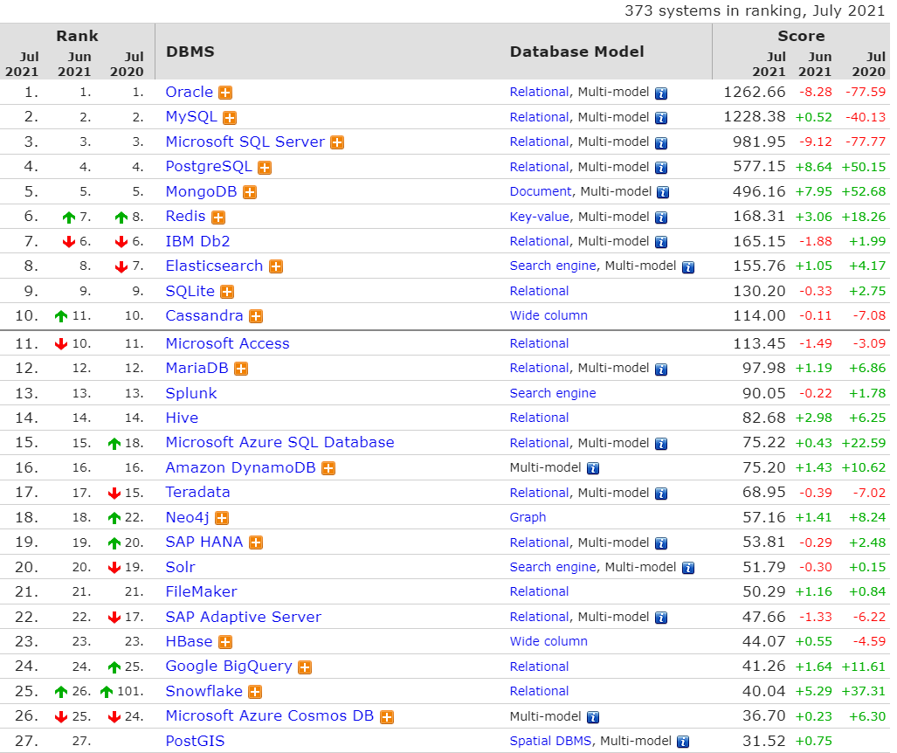
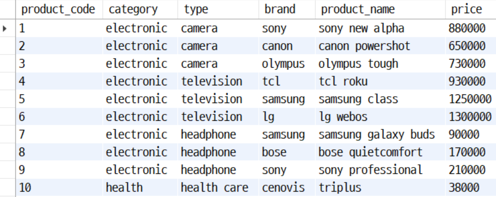
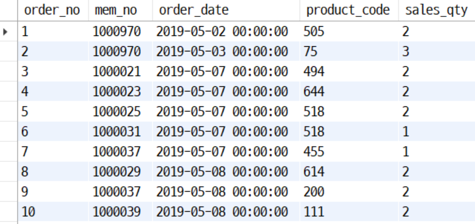

# COSADAMA - BASIC SQL WEEK1
작성자: 정찬, 이정윤   
참고자료: SQL/SB(MySQL)기본부터 파이썬/데이터분석 활용까지! (잔재미코딩), 부스트코드 1-1 SQL 및 관계형 데이터베이스(모원서), SQLite3로 가볍게 배우는 데이터베이스: SQL 기초 실습(최용)

### 0. SQL을 배우는 이유   

SQL을 배우는 이유를 알기 위해서는 우선 데이터 산업 전체에서 데이터베이스, 데이터베이스 조작의 역할에 대해서 알아야 합니다. 보통 사람들은 데이터를 저장할 때 편리하게 엑셀을 사용하곤 합니다. 그러나 기업은 수십만 혹은 그 이상의 모든 데이터를 엑셀로만 관리하기에는 한계가 있죠. 데이터베이스는 대용량의 데이터를 저장, 검색, 수정 등 체계적인 관리를 하기 위해서 사용됩니다. __SQL (Structured Query Language)__은 데이터베이스를 관리하는데 사용되는 프로그래밍 언어입니다.    

실제 업무에서 데이터베이스 구축까지는 하지 않을 수 있지만, 데이터베이스를 조작하고 다루는 방법을 숙지하고 있다면 일의 효율을 높일 수 있습니다. 이번 스터디에서는 데이터베이스의 구성을 파악하기 위한 간단한 구축 방법을 배우고 데이터베이스 조작법을 중점적으로 공부할 예정입니다. 

##### [참고] 데이터베이스의 장단점  

| 장점 | 단점 |
| ------ | ------ |
| 데이터 중복 최소화 | 데이터베이스 전문가 필요 |
| 데이터 공유 | 많은 비용 부담 |
| 일관성, 무결성, 보안성 유지 | 시스템의 복잡함 |
| 최신의 데이터 |  |
| 데이터의 표준화 가능 |  |
| 데이터의 논리적, 물리적 독립성 |  |
| 용이한 데이터 접근 |
| 데이터 저장 공간 절약|

전체적인 데이터 과학 분야에서 데이터를 수집하고 저장하는 작업은 초기 파트에 해당합니다. 이때까지 Python을 공부하면서 만들어진 데이터를 분석해서 인사이트를 찾거나, 시각화하는 작업 이전에 이루어지는 작업이라고 볼 수 있습니다. 

자! 이제 우리가 배울 MySQL에 대해서 살짝 알아봅시다. 
아래의 표는 2021년 기준 데이터 베이스 랭킹을 보여주는데, 관계형 데이터베이스 (Relational DataBase Management System)계열의 **Oracle**(대용량 데이터 저장에 많이 사용되는 안전한 DB), **MySQL**(Oracle사에서 라이선스를 소유한 Open Source), RDBMS보다 덜 제한적인 형식을 가져 최근 빅데이터 시대와 함께 떠오르는 NoSQL 계열의 **MongoDB, Redis, Cassandra, Hive** 등 데이터베이스 프로그램의 종류는 굉장히 다양합니다. 

 **MySQL**은 대표적인 오픈소스 관계형 데이터베이스 프로그램으로, 중소형 데이터를 저장하고 관리하기에 적합한 프로그램입니다. 
RDBMS계열에 속하는 데이터베이스 프로그램들은 유사한 명령어들을 사용하기 때문에 표준 SQL 언어 하나를 공부하면 대부분 다룰 수 있습니다. 우리는 가장 대중적으로 사용되는 MySQL을 활용하여 데이터베이스와 SQL 공부를 진행할 예정입니다.

### 1. MySQL 다운로드 및 workbench 사용법 

이제 MySQL을 다운받아 봅시다. 사용하는 환경에 따라 설치 방법이 다르니, 1.1과 1.2 중 선택적으로 학습하면 됩니다. MySQL 프로그램 다운로드는 한 번 꼬이면 살짝 까다로운 부분도 있으니, 동영상 강의에서 안내하는 순서대로 정확히 진행해줘야 합니다.   설치 환경마다 다를 수 있지만, 약 15분 정도 소요됩니다.   
설치 과정에서 원하는 비밀번호를 설정하는 부분이 있는데, 이 비밀번호는 꼭 잘 기억해둬야 합니다. Workbench 파일 Connection 할 때마다 이 비밀번호를 입력해줘야 하기 때문이죠. 
1.1. [Window OS](https://www.boostcourse.org/ds102/lecture/373285/?isDesc=false)
1.2. [Mac OS](https://www.boostcourse.org/ds102/lecture/373286/?isDesc=false)  

> 왜 이런 'Log-In'절차를 거쳐야할까요? 예를 들어 회사에서 월급을 지급하기 위해 관리하는 데이터베이스가 있다고 합시다. 거기에는 이름, **주민번호, 통장번호, 연봉**이 적혀 있을겁니다. 모든 사람이 이 정보에 접근하게 두면 개인정보의 문제가 생깁니다. 그래서 권한을 차등하기 위해 1차적으로 로그인 과정을 거치게 됩니다. 더 자세한 권한 분리는 트랜젝션 제어어TCL를 통해 구현할 수 있습니다. 하지만 그정도로 자세하게 데이터베이스를 구축할 필요는 없다고 판단해서 커리큘럼에는 포함하지 않았습니다. 관심 있으신 분들은 아래 링크에서 학습하시면 좋을 것 같습니다. (필수 아님) (https://www.boostcourse.org/ds102/lecture/373329/?isDesc=false)

MySQL Workbench는 SQL 명령어를 통해 서버에 접속하여 데이터베이스 설계, 관리 및 조작을 할 수 있는 환경을 제공하는 프로그램입니다. MySQL 조작을 시각적으로 보여줘서 보다 쉽게 할 수 있도록 도와주는 도구 역할을 한다고 생각하면 됩니다. python을 커널에서 열 수도 있지만 ipynb notebook에서 열 수도 있죠. MySQL도 비슷합니다. 
처음 접하는 만큼 본 스터디에서는 GUI(Graphic User Interface)인 Workbench를 활용합니다. 아래의 강의를 보고 간단한 Workbench 조작법을 익혀보세요! SQL 명령어에 익숙해진 뒤에는 커널(까만 창)에서 진행하는 CLI (Command Line Interface)를 사용할 수도 있겠죠?

1.3. [Workbench 사용법](https://www.boostcourse.org/ds102/lecture/373293/?isDesc=false) 

### 2. 데이터베이스와 관계형 데이터베이스(RDBMS)에 대한 기초 설명
#### 2.1. DBMS
__DBMS__ 는 __DataBase Management System__ 의 약자로, 다수의 사용자들이 데이터베이스의 데이터에 접근할 수 있게 해주는 소프트웨어 도구의 집합을 말합니다. 이때의 데이터베이스는 대량의 정보를 컴퓨터가 효율적으로 접근할 수 있도록 가공 및 저장한 것 입니다. 그렇다면, DBMS를 사용하는 이유는 무엇일까요? DBMS는 다음과 같은 장점을 갖기 때문입니다.

1. 여러 사람이 데이터를 공유하기 쉽다.
2. 대량의 데이터를 다루기 쉽다.
3. 분석 툴(Python 등)에서 읽기/쓰기 자동화 프로그래밍을 할 필요가 없다.
4. 보안에 장점이 있다(백업 용이)

#### 2.2. RDB, RDBMS
__RDB__ 는 __Relational DataBase__ 의 약자로, __관계형 데이터베이스__ 를 말합니다. 관계형 데이터베이스는 key, value 값을 2차원 표(table or dataframe) 형식으로 나타내며, 하나의 데이터베이스 안에는 여러 테이블이 존재할 수 있습니다. 또한 테이블은 row(record)와 column으로 이루어져 있는데, 이때의 각 column은 특정 데이터 타입을 갖습니다. 데이터 타입에 대한 설명은 아래에서 진행하도록 하겠습니다. 
따라서, __RDBMS ((Relational DataBase Management System)__ 는 관계형 데이터베이스, 즉 RDB를 생성, 갱신, 관리하기 위한 시스템을 의미합니다. row(record) 단위로 데이터 읽기/쓰기가 이루어지며, 보통 데이터를 조작하는 클라이언트가 SQL 언어로 서버에 요청하면 서버가 처리해 2차원 표 형태의 데이터를 반환합니다.   

> **테이블? 레코드? 튜플?**
> 
> 테이블table: pandas, R의 DataFrame입니다. 2차원 표라고 생각하시면 됩니다.
> 
> 레코드record: 행row
> 
> 튜플tuple: 열column

RDBMS의 종류는 앞서 SQL을 배우는 이유에서도 잠깐 언급했듯 굉장히 다양합니다. 종류들을 외우고 있어야 할 필요는 없지만 알고 있으면 좋은 기초 지식이니 가볍게 읽고 넘어가면 됩니다. 
1. __Oracle Database__: RDBMS의 역사라고 할 수 있음. 기술, 안정성이 뛰어나지만, 유료이므로 은행 등 변화보다 안정성이 중요한 업계에서 많이 사용됨.
2. __MySQL__: 오픈소스로, 쉽다는 최대의 장점을 가짐. 웹, php를 이용해 데이터베이스를 구축할 때 많이 사용됨. 대표적인 데이터베이스 기업인 오라클이 인수한 후에는 비용을 부과할지 모른다는 생각 때문에 이전하는 경우가 있음.
3. __MariaDB__: 오픈 소스. MySQL 기반으로 만들어져 비용 문제로부터 자유로움. 
4. __PostgreSQL__:  버클리 대학의 오픈소스 객체-관계형 데이터베이스. 객체-관계형 데이터 관리 시스템으로 더 풍부한 기능을 지원함. 
5. __SQL Server__: Microsoft에서 개발한 RDBMS. 윈도우 환경 지원.
6. __SQLite__: 데이터베이스를 서버가 아닌 파일로 저장하는 DBMS. 보통 기기 저장 공간에 간단하게 excel, csv 형태로 저장할 때 사용됨. 여러 사람이 이용하는 서버 이용은 불가능하지만 간단하게 데이터베이스를 구축할 때 유용함. 

#### 2.3. PRIMARY/FOREIGN KEY 
데이터베이스에서 사용하는 KEY는 기본적으로 TABLE의 열 (COLUMN)에 해당하며, 여러 종류가 있습니다. 이 KEY를 전부 아실 필요는 없지만, __PRIMARY, FOREIGN KEY의 관계__ 는 꼭 알아가시길 바랍니다.
- CANDIDATE KEY (후보키): TABLE의 COLUMN 중 유일하게 식별할 수 있는 열 (아직 KEY 아님)
- **PRIMARY KEY(기본키)**:  TABLE의 COLUMN 중 유일하게 식별하기 위해 사용하는 열(KEY). python dictionary의 key를 떠올리시면 됩니다. 빈 값이 있어서는 안되고NOT NULL, 모든 값은 UNIQUE해야합니다.
    → 주민번호, 고객 번호, 제품 코드 등 유일한 값으로 이루어져 있다.
- ALTERNATE KEY(대체키):  기본키PK를 제외한 후보키
- **FOREIGN KEY(외래키)**: 다른 TABLE의 기본키 PK를 참조하는 열. 한 테이블에 여러 FOREIGN KEY가 있을 수 있음(여러 열 참조 가능)

>  candidate = 후보, 후보자. 따라서 CANDIDATE KEY는 PRIMARY KEY(기본키)가 될 수 있는 컬럼들을 의미합니다. 모든 UNIQUE, NOT NULL 특징을 갖는 컬럼이라고 primary key가 될 수는 없습니다. CANDIDATE KEY 중 **하나**만이 PRIMARY KEY가 될 수 있습니다. 그 테이블을 대표하는 키이기 때문에 하나만 가능합니다.

PRIMARY KEY (PK)와 FOREIGN KEY (FK)에 대해서 조금 더 자세히 알아보도록 하겠습니다. 
예컨대 이러한 상품과 관련된 'PRODUCT' TABLE이 있다고 합시다.

CATEGORY, TYPE, BRAND, PRODUCT_NAME, PRICE는 유일하지 않기 때문에 PK가 되기에 부적절합니다. 따라서 각 ROW가 완벽히 유일한 COLUMN인 'PRODUCT_CODE'를 PK로 설정해 줄 수 있습니다.

이번엔 판매와 관련된 'SALES' TABLE이 있다고 합시다.

고객정보를 뜻하는 MEM_NO, 주문한 제품을 의미하는 PRODUCT_CODE는 여러 주문을 할 수 있으니 PK로 적절하지 않습니다. ORDER_DATE, SALES_QTY도 PK로는 부적절 합니다. 이때, 'PRODUCT' TABLE의 PK였던 PRODUCT_CODE  COLUMN이 'SALES' TABLE에도 사용되고 있습니다. 하지만 PK역할을 하지는 않죠? 이렇게 **다른 테이블의 PK를 가져다가 참조하는 경우를 FOREIGN KEY라고 합니다**. FK인 경우에는 꼭 유일UNIQUE하지 않아도 괜찮습니다. 즉, 한 테이블에 FK는 여러개일 수 있습니다.

복잡해 보이는 PK, FK를 사용하는 이유는 무엇일까요? 바로 모든 데이터를 한 TABLE에 저장하지 않기 위해서입니다. 만약 제품, 고객, 판매와 관련된 모든 데이터를 한 TABLE에 저장한다면 어떻게 될까요? 고객 입장에서 어떤 제품을, 몇 개, 몇 시에 주문했는지, 전화번호, 주소는 어떻게 되는지  등등 중복되는 값이 너무 많을겁니다. 그러면 데이터베이스의 NULL값이 커지고 데이터베이스의 용량이 커집니다. 가독성은 떨어지고, 비용은 늘어나죠.
결론적으로 PK와 FK를 사용하는 이유는 
1. __전체 데이터의 양을 줄이고, 효과적으로 메모리, 저장 공간(서버) 관리를 하기 위해!__ 
2. __각각의 주제에 대한 최소한의 TABLE을 만들고, 서로 참조하게 만들기 위해!__ 

정도로 정리할 수 있겠네요. 

[참고자료](https://blog.yena.io/studynote/2018/10/02/DBMS-SQL.html)

#### 2.4. 데이터 타입 
데이터 타입은 저장 공간을 효율적으로 사용하기 위해 바이트 수를 미리 정의하는 것 입니다. 예를 들어 나이와 관련한 데이터를 저장할 때, 나이는 최대 3자리 수(3byte) 이상을 넘어가지는 않으니 TINYINT (~127)로 지정한다면 저장 공간이 낭비되지 않습니다. (메모리를 적게 차지하니까 그만큼 컴퓨터의 연산 속도도 빨리집니다!) 이처럼 데이터 베이스의 TABLE을 만들 때는 각 COLUMN의 데이터 타입을 저장하는 데이터의 종류, 크기에 따라 지정해주는 과정이 필요합니다. 따라서 적합한 데이터 타입을 지정해주기 위해서는 데이터 타입 종류에 대한 이해 및 암기가 필요합니다.   

아래 표에는 거의 모든 데이터 타입이 정리되어 있는데, 이 중에서 숫자형의 INT와 문자형의 VARCHAR(), TEXT 등 많이 사용되는 몇 가지의 타입만 기억해두면 됩니다.   
추가로, 가변 길이 데이터 타입인 VARCHAR와 고정 길이 데이터 타입인 CHAR의 차이를 예시를 통해 덧붙이겠습니다. 예를 들어,  'ABC' 라는 데이터가 입력되었을 때, VARCHAR(5)로 지정된 COLUMN에서는 ABC 세 자리만 저장하고 남은 두 자리는 채우지 않습니다. 반면 고정형인 CHAR(5)로 지정된 COLUMN에서는 ABC 세 자리를 채운 뒤, 남은 두 자리는 공백 (SPACE)로 채우게 됩니다. 즉, 정해진 길이보다 입력된 데이터의 길이가 짧을 경우 고정 길이는 그대로 인식하고 가변 길이는 유동적으로 인식한다는 것입니다. VARCHAR가 CHAR에 비해 아주 미세하게 느린 특징이 있으니 상황에 따라 적절하게 선택하면 됩니다. 

|  | 데이터 타입 | 정의 |
|---|:---:|:---:|
| 숫자형 | `INT` | 정수형 데이터 타입(4byte). -2147483648 ~ +2147483647 또는 0 ~ 4294967295수 표현 가능 |
| 숫자형 | `TINYINT` | 정수형 데이터 타입(1byte). -128 ~ +127 또는 0 ~ 255수 표현 가능 |
| 숫자형 | `SMALLINT` | 정수형 데이터 타입(2byte). -32768 ~ 32767 또는 0 ~ 65536수 표현 가능 |
| 숫자형 | `MEDIUMINT` | 정수형 데이터 타입(3byte). -8388608 ~ +8388607 또는 0 ~ 16777215수 표현 가능 |
| 숫자형 | `BIGINT` | 정수형 데이터 타입(8byte). 무제한 수 표현 가능 |
| 숫자형 | `FLOAT(정수부 길이, 소수부 자릿수)` | 부동 소수형 데이터 타입(4byte). 고정 소수점을 사용하는 형태 |
| 숫자형 | `DECIMA(정수부 길이, 소수부 자릿수)` | 고정 소수형 데이터 타입(길이+1byte). 소수점을 사용하는 형태 |
| 숫자형 | `DOUBLE(정수부 길이, 소수부 자릿수)` | 부동 소수형 데이터 타입(8byte). DOUBLE을 문자열로 저장 |
| 문자형 | `VARCHAR(n)` | 가변 길이 데이터 타입 (n <= 65535) |
| 문자형 | `CHAR(n)` | 고정 길이 데이터 타입 (n <= 255) |
| 문자형 | `TEXT(n)` | 문자열 데이터 (n <= 65535) |
| 문자형 | `TINYTEXT(n)` | 문자열 데이터 (n <= 255) |
| 문자형 | `MEDIUMTEXT(n)` | 문자열 데이터 (n <= 16777215) |
| 문자형 | `LONGTEXT(n)` | 문자열 데이터 (n <= 4294967295) |
| 날짜형 | `DATE` | 날짜(YYYY-MM-DD) 형태의 기간 표현 데이터 타입(3byte) |
| 날짜형 | `TIME` | 시간(hh:mm:ss) 형태의 기간 표현 데이터 타입(3byte) |
| 날짜형 | `DATETIME` | 날짜와 시간 (YYYY-MM-DD hh:mm:ss) 형태의 기간 표현 데이터 타입(8byte) |
| 날짜형 | `TIMESTAMP` | 날짜와 시간 형태의 기간 표현 데이터 타입(4byte) 시스템 변경 시 자동으로 그 날짜와 시간이 저장 |
| 날짜형 | `YEAR(n)` | 연도 표현 데이터 타입(1byte) n은 2또는 4로 지정가능. |

데이터 타입에 대한 추가적인 학습 및 예시는 아래의 링크를 참고해보세요. 
[참고자료](https://nomadlee.com/mysql-%EC%B5%9C%EC%A0%81%EC%9D%98-%EB%8D%B0%EC%9D%B4%ED%84%B0-%ED%83%80%EC%9E%85-%EC%84%A0%ED%83%9D-%EB%B0%A9%EB%B2%95/) / [TCP School - 타입](http://tcpschool.com/mysql/mysql_datatype_numeric)

### 3. DB, TABLE 만들기 
동영상 강의를 시청하면서 Workbench로 실습해보세요.   (DCL, TCL제외)

3.1. SQL 명령어 
* [SQL 기본 명령어](https://www.boostcourse.org/ds102/lecture/373315/?isDesc=false) 
* [데이터 정의어(DDL)](https://www.boostcourse.org/ds102/lecture/373320/?isDesc=false)
* [데이터 조작어(DML)](https://www.boostcourse.org/ds102/lecture/373325/?isDesc=false)

3.2. SQL 문법
* [데이터 조회 (SELECT)](https://www.boostcourse.org/ds102/lecture/373356?isDesc=false)

